# [Finite State](https://finitestate.io) `third-party-upload` Extension for Azure DevOps

[finitestate.io](https://finitestate.io)

## Description

The `third-party-upload` Github Action allows you to integrate Finite State's third-party upload scanning capabilities into your workflow.

The action will:

- Create a new asset version for an existing asset
- Upload the SBOM, scan, or test output
- Associate the results with the new asset version

By default, the new version adopts the asset's existing values for Business Unit and Created By User. If you need to change these, you can provide IDs for them.

## Inputs

| parameter | description | required | type | default |
| --- | --- | --- | --- | --- |
| finiteStateClientId            | Finite State API client ID                                                                                                                           | `true`   | `string`   |         |
| finiteStateSecret               | Finite State API secret                                                                                                                              | `true`   | `string`   |         |
| finiteStateOrganizationContext | The Organization-Context should have been provided to you by your Finite State representative and looks like `xxxxxxx-xxxx-xxxx-xxxx-xxxxxxxxxxxx`                    | `true`   | `string`   |         |
| assetId                          | Asset ID for the asset that the new  asset version will belong to                                                                                                             | `true`   | `string`   |         |
| version                           | The name of the asset version that will be created                                                                                                  | `true`   | `string`   |         |
| filePath                         | Local path of the file to be uploaded                                                                                                                   | `true`   | `string`   |         |
| testType | Test type. This must be one of the list of supported upload types. For the full list of supported upload types, review [this list](https://docs.finitestate.io/supported-file-types). | `true` | `string` |  |
| automaticComment | Defaults to false. If it is true, it will generate a comment in the PR with the link to the Asset version URL in the Finite State Platform. | `false`  | `boolean`   | `false` |
| businessUnitId | (optional) Business Unit ID to assign to the new asset version. If not provided, the existing business unit belonging to the asset will be used. | `false` | `string`  |  |
| createdByUserId | (optional) Created By User ID to assign to the asset version. If not provided, the existing Created By User for the asset will be used. | `false` | `string`  |  |
| productId | (optional) Product ID to assign to the asset version. If not provided, the existing product for the asset will be used. | `false` | `string`  |  |
| artifactDescription | (optional) Description of the artifact being scanned (e.g. "Source Code Repository", "Container Image"). | `false` | `string`  |  |
<!-- action-docs-inputs -->

## Set Up Workflow

To start using this Extension, you must [install](https://learn.microsoft.com/en-us/azure/devops/marketplace/install-extension?view=azure-devops&tabs=browser) it using [Azure DevOps Markeplace](https://marketplace.visualstudio.com/items?itemName=finite-state.binary-scan).

After it is installed, you can use it in your pipeline by finding the task in the right Tasks panel:

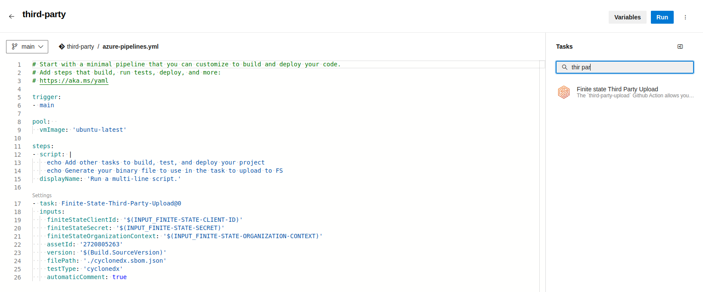

You can customize the input parameters, as you see in the next image:

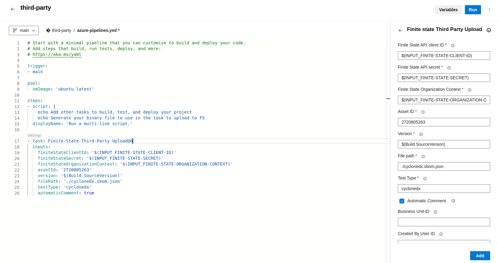

Although you can write some values directly in the input fields, we recommend storing some sensitive values as secrets, rather than hardcoding them directly in the pipeline yml file. At minimum, the following values should be stored as secrets:
- Finite State Client ID, 
- Finite State Secret ID and 
- Finite State Context organization

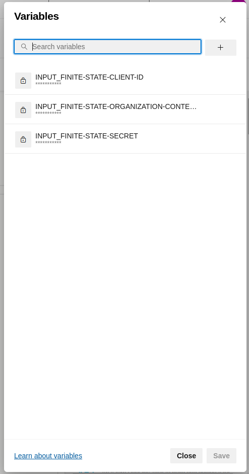

## Generate a Comment on a PR with the Link to the Results on the Finite State Platform
If you want the extension to automatically generate a PR comment with the link to the results on the Finite State Platform, make sure to give permissions to the azure pipeline token [`System.AccessToken`](https://learn.microsoft.com/en-us/azure/devops/pipelines/build/variables?view=azure-devops&tabs=yaml#systemaccesstoken). Then, grant the necessary permissions to the associated Azure Token by going to `Project Settings > Repositories > Security tab` as you can see in the follow image:

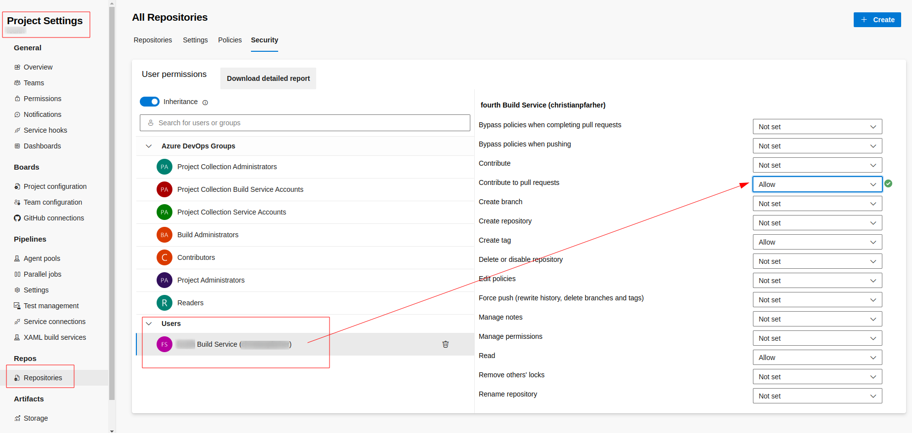

This allows the action to post the comment in the PR when the `automaticComment` is checked (`true`). After this step, you will get a comment in the PR with a link that points to the binary uploaded in the Finite State Platform:

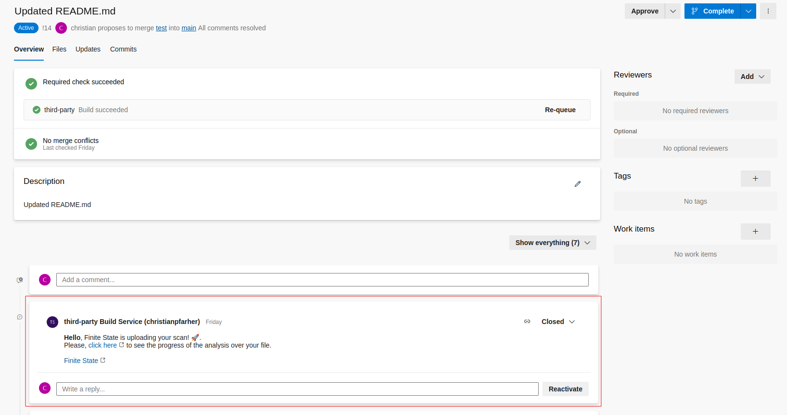

### Build Policy
You will need to configure a build policy over your main branch in order to auto start a build process. This way, when you make a modification to a branch that has a PR associated with it, the pipeline will be executed automatically and generate a comment using the task configured.

To set up a policy, you need to go to `Repositories > Branches`. Then click on the three point in your main branch and select Branch policies in the dropdown menu:

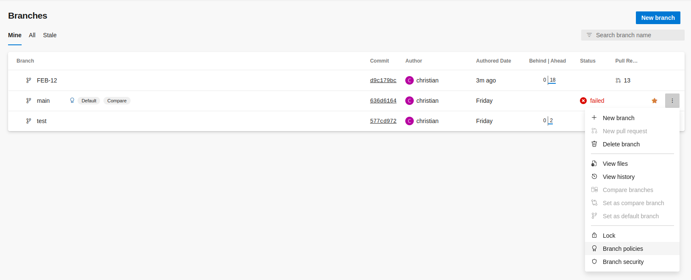

In the popup, save the settings as follow:

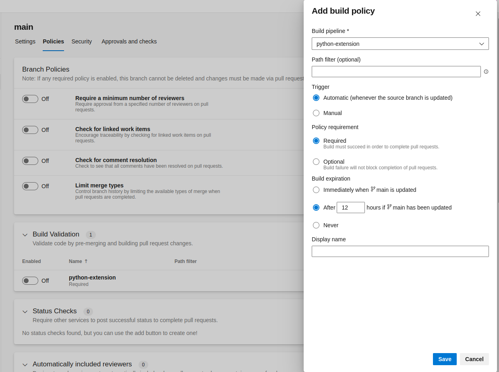

After that, you will see a configuration option similar to this:

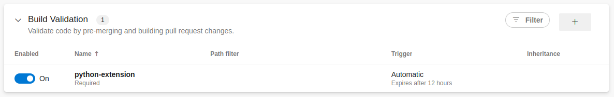

Going forward, each commit to a branch associated with a PR that is requested to be merge to the main branch will trigger the pipeline execution automatically and execute the Finite State task:

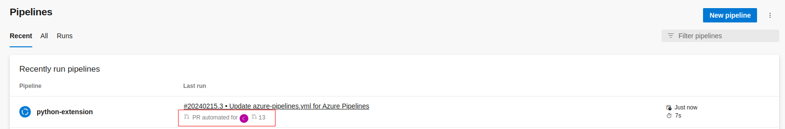

The extension will show some information/details about the result of the execution:

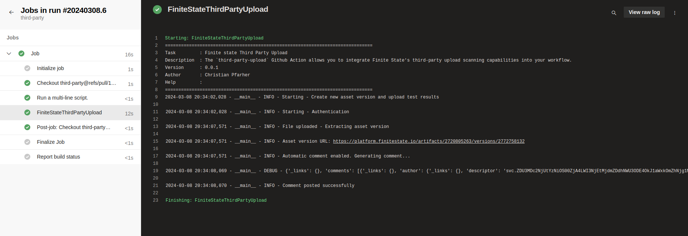

## Action Debugging

All details pertaining to the execution of the extension will be recorded. You can review this information in the workflow execution logs, which is a helpful starting point if you encounter any errors during the extension's run.

If you have any errors, we recommend to enabling the System diagnostics whe you run the pipeline:

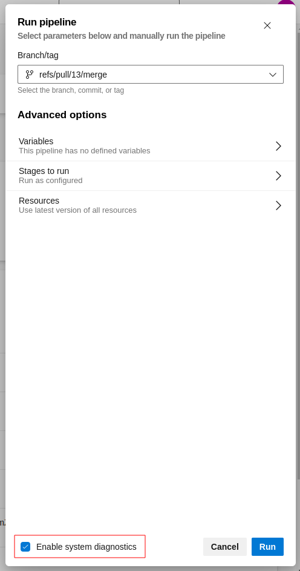

Example of the output when system diagnostics is enabled:

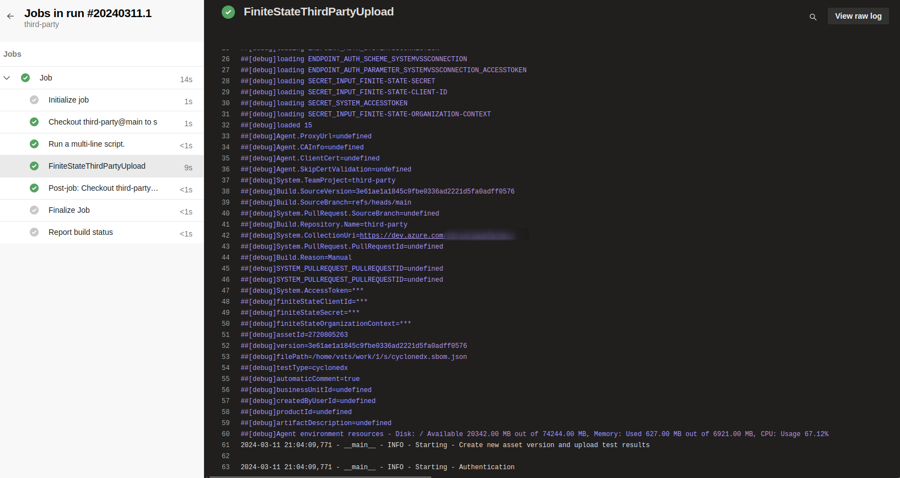
